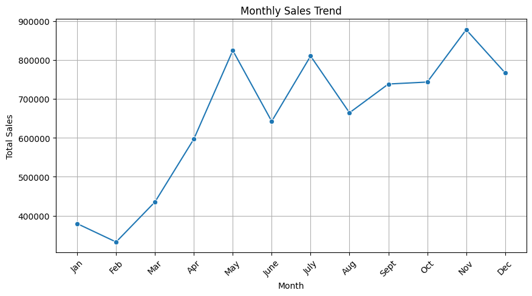
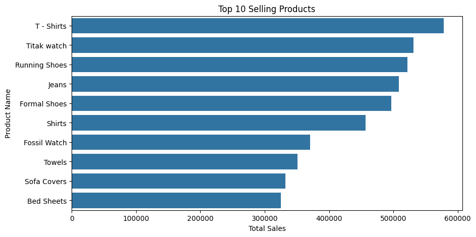
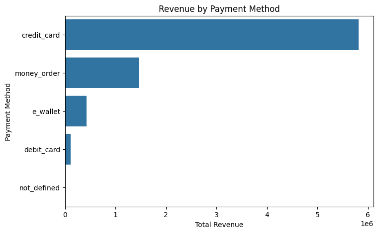
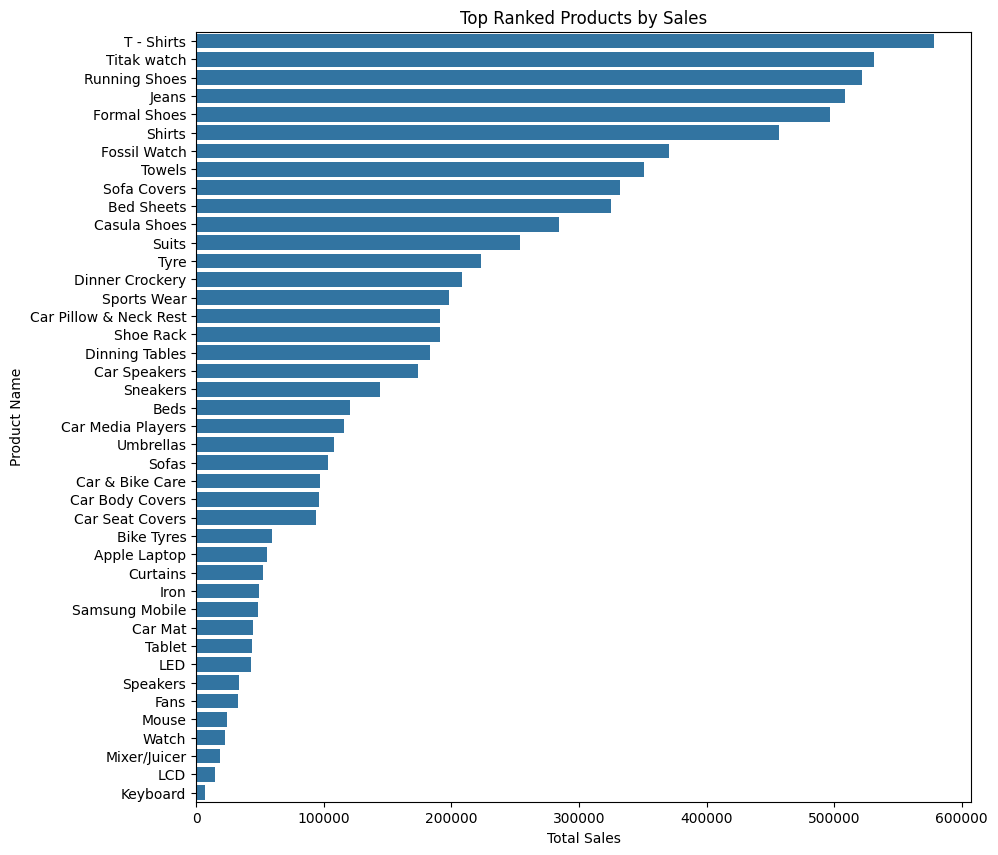
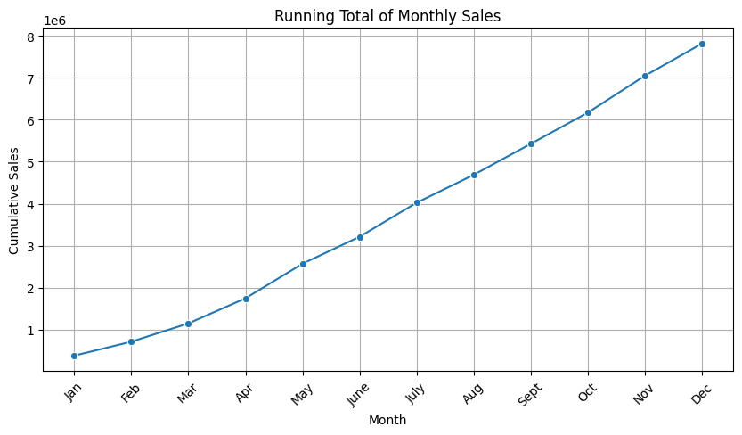
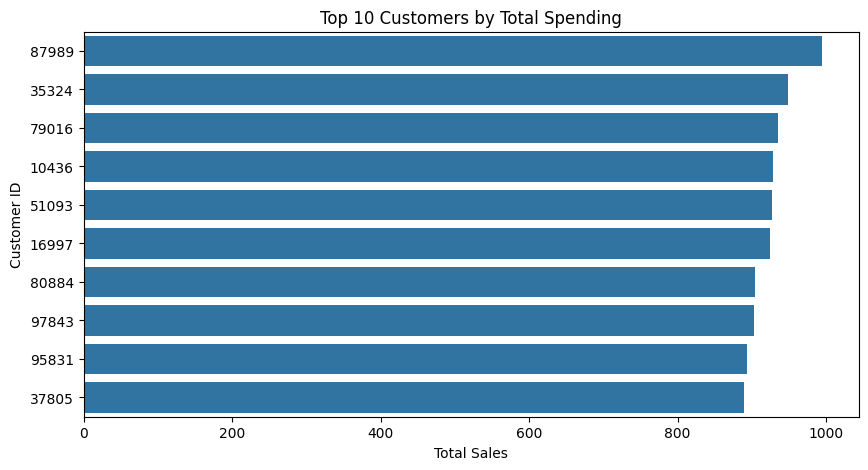
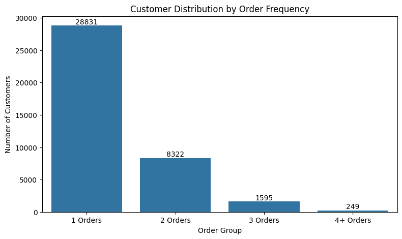
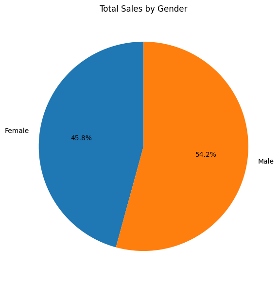

# E-Commerce Sales & Customer Analytics


##  Project Overview

This project analyzes an e-commerce order dataset using **SQL and
Python** to understand sales performance, product performance, customer
purchasing behavior, shipping costs, payment trends, and order
fulfillment.

The analysis follows a practical analytics workflow:

**E-commerce database → SQL queries → KPI extraction → customer/product
analysis → Python visualization → business insights → recommendations**

The project focuses on turning transactional data into actionable
business insights that can support revenue growth, customer retention,
inventory planning, payment optimization, and fulfillment decisions.

------------------------------------------------------------------------

##  Project Objectives

The main objectives of the project are:

- Analyze overall **sales, profit, and profit margin**.
- Track **monthly sales and profit trends**.
- Identify **top-selling products** and product rankings.
- Identify **high-spending customers**.
- Analyze **repeat customer behavior and order distribution**.
- Analyze **sales contribution by gender**.
- Identify **preferred payment methods** and their revenue contribution.
- Convert SQL results into **Python/Seaborn/Matplotlib visualizations**.
- Translate analytical findings into **business recommendations**.

------------------------------------------------------------------------

##  Tools & Technologies

| Tool                                | Purpose                                                        |
|-------------------------------------|----------------------------------------------------------------|
| **SQLite**                          | Database management and SQL execution                          |
| **SQL**                             | Data extraction, aggregation, joins, CTEs and window functions |
| **Python**                          | Analysis and visualization                                     |
| **Pandas**                          | Data manipulation and SQL result handling                      |
| **Matplotlib**                      | Visualization                                                  |
| **Seaborn**                         | Statistical/business visualizations                       |


------------------------------------------------------------------------

##  Dataset Overview

The dataset contains **51,290 records and 16 columns**.

### Numerical columns

- Sales
- Quantity
- Discount
- Profit
- Shipping_Cost
- Aging

### Categorical columns

- Gender
- Device_Type
- Customer_Login_type
- Product_Category
- Product
- Order_Priority
- Payment_Method

### Date/Time columns

- Order_Date
- Time

The data contains information about customers, products, orders, sales,
profit, shipping, payment methods, and order fulfillment.

------------------------------------------------------------------------

#  SQL Analysis

## 1. Total Sales, Profit & Profit Margin

### Query

``` sql
SELECT
    SUM(Sales) AS Total_Sales,
    SUM(Profit) AS Total_Profit,
    ROUND(SUM(Profit) * 100.0 / SUM(Sales), 2) AS Profit_Margin_Pct
FROM Orders;
```

### Result

| KPI           |              Value |
|---------------|-------------------:|
| Total Sales   |    **\$7,813,411** |
| Total Profit  | **\$3,611,186.60** |
| Profit Margin |         **46.22%** |

### Business insight

The business generated approximately **\$7.81M in sales** and **\$3.61M
in profit**, resulting in a **46.22% profit margin** based on the
dataset’s Sales and Profit fields.

------------------------------------------------------------------------

#  2. Monthly Sales Performance

### Query

``` sql
SELECT
    strftime('%Y-%m', Order_Date) AS Month,
    SUM(Sales) AS Monthly_Sales,
    SUM(Profit) AS Monthly_Profit
FROM Orders
GROUP BY Month
ORDER BY Month;
```

This query groups orders by month and calculates monthly sales and
profit.

### Visualization

<figure>

<figcaption aria-hidden="true">Monthly Sales Trend</figcaption>
</figure>

### Business insight

The monthly trend shows meaningful variation in sales throughout the
year. The analysis highlights stronger sales periods, particularly
around **May and November**, which can be used for seasonal campaign and
inventory planning.

------------------------------------------------------------------------

#  3. Top-Selling Products

### Query

``` sql
SELECT
    P.Product_Name,
    P.Product_Category,
    SUM(O.Sales) AS Total_Sales,
    SUM(O.Quantity) AS Total_Units_Sold
FROM Orders O
JOIN Products P
    ON O.Product_Id = P.Product_Id
GROUP BY P.Product_Name, P.Product_Category
ORDER BY Total_Sales DESC
LIMIT 10;
```

### Top products in the analysis

| Product       | Category |     Sales | Units Sold |
|---------------|----------|----------:|-----------:|
| T - Shirts    | Fashion  | \$578,336 |      5,986 |
| Titak watch   | Fashion  | \$531,468 |      6,254 |
| Running Shoes | Fashion  | \$522,144 |      6,064 |
| Jeans         | Fashion  | \$508,376 |      5,946 |
| Formal Shoes  | Fashion  | \$496,503 |      6,154 |

### Visualization

<figure>

<figcaption aria-hidden="true">Top Selling Products</figcaption>
</figure>

### Business insight

Fashion products dominate the top-selling list. **T-Shirts, Titak
Watches, Running Shoes, Jeans, and Formal Shoes** are among the
strongest revenue-generating products.

This suggests prioritizing inventory availability and promotional
activity around proven high-performing products.

------------------------------------------------------------------------

#  4. Payment Method Analysis

### Query

``` sql
SELECT
    Payment_Method,
    COUNT(Order_Id) AS Total_Orders,
    SUM(Sales) AS Total_Revenue
FROM Orders
GROUP BY Payment_Method
ORDER BY Total_Revenue DESC;
```

### Result

| Payment Method | Orders |     Revenue |
|----------------|-------:|------------:|
| Credit Card    | 38,137 | \$5,819,379 |
| Money Order    |  9,629 | \$1,461,269 |
| E-Wallet       |  2,789 |   \$422,750 |
| Debit Card     |    734 |   \$109,979 |
| Not Defined    |      1 |        \$34 |

### Visualization

<figure>

<figcaption aria-hidden="true">Revenue by Payment Method</figcaption>
</figure>

### Business insight

Credit cards account for approximately **74.5% of total revenue**,
making them the dominant payment method.

E-wallet revenue is comparatively small, indicating an opportunity to
test incentives such as cashback, discounts, or checkout promotions to
increase adoption.

------------------------------------------------------------------------

#  5. Product Ranking Using Window Functions

The project also demonstrates a SQL **window function** using `RANK()`.

### Query

``` sql
SELECT
    P.Product_Name,
    P.Product_Category,
    SUM(O.Sales) AS Total_Sales,
    RANK() OVER (ORDER BY SUM(O.Sales) DESC) AS Sales_Rank
FROM Orders O
JOIN Products P
    ON O.Product_Id = P.Product_Id
GROUP BY P.Product_Name, P.Product_Category
ORDER BY Total_Sales DESC;
```

### Visualization

<figure>

<figcaption aria-hidden="true">Top Ranked Products</figcaption>
</figure>

### Why use `RANK()`?

`RANK()` allows products to be ordered according to total sales while
retaining each product as an individual row.

### Business insight

The ranking confirms that **T-Shirts, Watches, Running Shoes, Jeans, and
Formal Shoes** are among the leading products. This can support
inventory prioritization and product-focused marketing.

------------------------------------------------------------------------

#  6. Running Total of Monthly Sales

### Query

``` sql
WITH MonthlySales AS (
    SELECT
        strftime('%Y-%m', Order_Date) AS Month,
        SUM(Sales) AS Monthly_Sales
    FROM Orders
    GROUP BY Month
    ORDER BY Month
)
SELECT
    Month,
    Monthly_Sales,
    SUM(Monthly_Sales) OVER (
        ORDER BY Month
        ROWS BETWEEN UNBOUNDED PRECEDING AND CURRENT ROW
    ) AS Running_Total
FROM MonthlySales;
```

### Visualization

<figure>

<figcaption aria-hidden="true">Running Total of Monthly
Sales</figcaption>
</figure>

### Why use a CTE and window function?

The CTE first creates monthly sales totals. The windowed `SUM()` then
calculates the cumulative sales across the months.

### Business insight

The running-total analysis provides a cumulative view of revenue growth
and helps track how monthly sales contribute to the overall annual
performance.

------------------------------------------------------------------------

#  7. Customer Segmentation by Spending

### Query

``` sql
WITH CustomerSpending AS (
    SELECT
        O.Customer_Id,
        SUM(O.Sales) AS Total_Sales,
        SUM(O.Profit) AS Total_Profit
    FROM Orders O
    GROUP BY O.Customer_Id
)
SELECT
    C.Customer_Id,
    C.Gender,
    CustomerSpending.Total_Sales,
    CustomerSpending.Total_Profit
FROM CustomerSpending
JOIN Customers C
    ON C.Customer_Id = CustomerSpending.Customer_Id
ORDER BY CustomerSpending.Total_Sales DESC
LIMIT 10;
```

### Example result

| Customer ID | Gender | Total Sales | Total Profit |
|------------:|--------|------------:|-------------:|
|       87989 | Male   |       \$994 |     \$497.90 |
|       35324 | Male   |       \$949 |     \$489.30 |
|       79016 | Male   |       \$935 |     \$443.20 |
|       10436 | Male   |       \$929 |     \$546.90 |
|       51093 | Female |       \$927 |     \$505.80 |

### Visualization

<figure>

<figcaption aria-hidden="true">Top Customers by Spending</figcaption>
</figure>

### Business insight

The analysis identifies high-spending customers who can be targeted with
loyalty programs, personalized offers, and recommendations to encourage
continued purchases.

------------------------------------------------------------------------

#  8. Order Processing & Shipping Cost Analysis

## Average order processing/aging

``` sql
SELECT AVG(Aging) AS Avg_Processing_Time
FROM Orders;
```

### Result

**Average value: 5.255**

This provides an overall view of the dataset’s order aging/processing
measure.

## Shipping cost by order priority

``` sql
SELECT
    Order_Priority,
    COUNT(Order_Id) AS Total_Orders,
    AVG(Shipping_Cost) AS Avg_Shipping_Cost
FROM Orders
GROUP BY Order_Priority
ORDER BY Avg_Shipping_Cost DESC;
```

### Result

| Priority | Orders | Average Shipping Cost |
|----------|-------:|----------------------:|
| Critical |  3,932 |                 7.224 |
| High     | 15,499 |                 7.181 |
| Low      |  2,424 |                 6.977 |
| Medium   | 29,433 |                 6.949 |
| None     |      2 |                14.450 |

### Business insight

Critical and High priority orders have slightly higher average shipping
costs than Medium and Low priority orders. The two `None` priority
records have a higher average but are too few to drive a general
conclusion.

This analysis can support logistics-cost monitoring and
shipping-priority optimization.

------------------------------------------------------------------------

#  9. Repeat Customer Rate

### Query

``` sql
WITH CustomerOrders AS (
    SELECT
        Customer_Id,
        COUNT(DISTINCT Order_Id) AS Total_Orders
    FROM Orders
    GROUP BY Customer_Id
)
SELECT
    COUNT(CASE WHEN Total_Orders > 1 THEN 1 END)
    * 100.0 / COUNT(*) AS Repeat_Customer_Rate
FROM CustomerOrders;
```

### Result

**Repeat Customer Rate: 26.07%**

This means approximately **26.1% of customers placed more than one
order**, using the project’s definition of a repeat customer.

------------------------------------------------------------------------

#  10. Customer Order Distribution

### Query

``` sql
WITH order_distribution AS (
    SELECT
        Customer_Id,
        COUNT(DISTINCT Order_Id) AS Total_Orders
    FROM Orders
    GROUP BY Customer_Id
)
SELECT
    CASE
        WHEN Total_Orders = 1 THEN '1 Orders'
        WHEN Total_Orders = 2 THEN '2 Orders'
        WHEN Total_Orders = 3 THEN '3 Orders'
        ELSE '4+ Orders'
    END AS Order_Group,
    COUNT(*) AS Customers
FROM order_distribution
GROUP BY Order_Group
ORDER BY Customers DESC;
```

### Result

| Order Group | Customers |
|-------------|----------:|
| 1 Order     |    28,831 |
| 2 Orders    |     8,322 |
| 3 Orders    |     1,595 |
| 4+ Orders   |       249 |

### Visualization

<figure>

<figcaption aria-hidden="true">Customer Distribution by Order
Frequency</figcaption>
</figure>

### Business insight

The largest customer segment consists of one-time buyers.

Approximately:

**28,831 / 38,997 = 73.9%**

of customers made only one order.

This indicates a significant opportunity to improve repeat purchasing
through loyalty programs, personalized offers, recommendations, and
post-purchase engagement.

------------------------------------------------------------------------

#  11. Total Sales by Gender

### Query

``` sql
SELECT
    C.Gender,
    SUM(O.Sales) AS Total_Sales
FROM Customers C
JOIN Orders O
    ON C.Customer_Id = O.Customer_Id
GROUP BY C.Gender;
```

### Result

| Gender | Total Sales |
|--------|------------:|
| Female | \$3,574,837 |
| Male   | \$4,238,574 |

### Visualization

<figure>

<figcaption aria-hidden="true">Total Sales by Gender</figcaption>
</figure>

### Business insight

Male customers contribute approximately **54.2% of total sales**, while
female customers contribute approximately **45.8%**.

The difference in sales is approximately **\$663,737**.

This can be used as one customer-segmentation dimension, but it should
not be interpreted as evidence that one gender is inherently more
valuable without also analyzing customer counts and average spending.

------------------------------------------------------------------------

#  Visualization Summary

The project includes the following visualizations:

| \#  | Visualization                            | Purpose                                |
|-----|------------------------------------------|----------------------------------------|
| 1   | Monthly Sales Trend                      | Identify sales trends and peak periods |
| 2   | Top 10 Selling Products                  | Identify highest-revenue products      |
| 3   | Revenue by Payment Method                | Understand payment preferences         |
| 4   | Top Ranked Products                      | Visualize SQL `RANK()` results         |
| 5   | Running Total of Monthly Sales           | Track cumulative revenue               |
| 6   | Top 10 Customers by Spending             | Identify high-value customers          |
| 7   | Customer Distribution by Order Frequency | Analyze repeat purchasing              |
| 8   | Total Sales by Gender                    | Compare sales contribution by gender   |

------------------------------------------------------------------------

#  Key Business Insights

## 1. Strong overall financial performance

The business generated approximately **\$7.81M in sales** and **\$3.61M
in profit**, with a calculated **46.22% profit margin**.

## 2. Customer retention is the biggest opportunity

The repeat customer rate is **26.07%**, and approximately **73.9% of
customers made only one order**.

This suggests that increasing repeat purchases could be an important
growth opportunity.

## 3. Fashion products dominate top sales

T-Shirts, Watches, Running Shoes, Jeans, and Formal Shoes are among the
highest-selling products.

Inventory and promotions should prioritize products with proven demand.

## 4. Sales are concentrated in certain periods

The monthly analysis shows stronger sales periods, particularly around
**May and November**.

These periods can be used for targeted campaigns and inventory
preparation.

## 5. Credit cards dominate payment revenue

Credit cards generate approximately **\$5.82M**, or around **74.5% of
total revenue**.

E-wallet adoption is comparatively low and could be increased through
targeted incentives.

## 6. High-value customers should receive targeted engagement

The customer-level analysis identifies high-spending customers who can
be targeted through personalized promotions and loyalty programs.

## 7. Shipping cost varies with order priority

Critical and High priority orders have somewhat higher average shipping
costs than Medium and Low priority orders.

This can be monitored to improve fulfillment efficiency.

------------------------------------------------------------------------

#  Business Recommendations: How to Improve E-Commerce Performance

### 1. Improve repeat purchases

Because approximately 73.9% of customers are one-time buyers:

- Introduce loyalty/reward programs.
- Send post-purchase follow-up campaigns.
- Offer incentives for the second purchase.
- Use personalized product recommendations.
- Create targeted remarketing campaigns.

**Goal:** Increase repeat customer rate and customer lifetime value.

------------------------------------------------------------------------

### 2. Prioritize high-performing products

Use product sales rankings to:

- Maintain adequate inventory.
- Reduce stockout risk for high-demand products.
- Build product bundles.
- Cross-sell complementary products.
- Align promotional campaigns with proven demand.

**Goal:** Maximize revenue from products with demonstrated demand.

------------------------------------------------------------------------

### 3. Plan inventory and marketing around peak periods

The monthly sales analysis shows stronger sales periods.

Recommended actions:

- Prepare inventory before peak months.
- Increase marketing activity around strong periods.
- Study successful campaigns from peak periods.
- Use targeted promotions during weaker periods.

**Goal:** Capture peak demand while reducing seasonal sales
fluctuations.

------------------------------------------------------------------------

### 4. Strengthen high-value customer engagement

Create customer segments based on spending and purchase frequency.

Recommended actions:

- VIP/loyalty programs.
- Personalized discounts.
- Early access to products.
- Personalized recommendations.
- Rewards for repeat purchases.

**Goal:** Improve retention and customer lifetime value.

------------------------------------------------------------------------

### 5. Increase e-wallet adoption

Credit cards dominate payment revenue while e-wallet contribution is
relatively low.

Possible actions:

- Cashback campaigns.
- E-wallet-specific discounts.
- Promotional checkout messaging.
- Partnerships with payment providers.

**Goal:** Increase payment-method adoption and diversify payment usage.

------------------------------------------------------------------------

### 6. Optimize shipping and fulfillment

Monitor shipping costs across priority levels.

Recommended actions:

- Review premium/critical shipping usage.
- Negotiate logistics rates.
- Optimize fulfillment operations.
- Monitor shipping costs by priority and order volume.

**Goal:** Reduce fulfillment costs while maintaining service quality.

------------------------------------------------------------------------

### 7. Use customer segmentation for targeted marketing

Combine:

- Spending
- Order frequency
- Gender
- Product preferences
- Payment behavior

rather than relying on a single demographic variable.

**Goal:** Improve campaign relevance and marketing efficiency.

------------------------------------------------------------------------

#  Conclusion: Action Plan for Growth

The analysis shows that the e-commerce business has **strong overall
financial performance**, but there are clear opportunities to improve
customer retention and operational efficiency.

### Recommended priorities

| Priority     | Action                      | Reason                                                    |
|--------------|-----------------------------|-----------------------------------------------------------|
|  High      | Improve repeat purchases    | ~73.9% of customers made only one order                   |
|  High      | Engage high-value customers | High-spending customers can support recurring revenue     |
|  Medium    | Prioritize top products     | Fashion products dominate top sales                       |
|  Medium    | Plan for peak periods       | Stronger sales occur in specific months                   |
|  Medium    | Promote e-wallet usage      | Credit cards account for ~74.5% of revenue                |
|  Long-term | Optimize shipping           | Priority levels show differences in average shipping cost |
|  Long-term | Improve segmentation        | Combine spending, purchase frequency and demographics     |

### Final conclusion

> The analysis indicates that the business is financially strong but has
> significant opportunities to improve customer retention and
> operational efficiency. The most important growth opportunity is
> converting one-time buyers into repeat customers through loyalty
> programs, personalized offers, targeted follow-ups, and product
> recommendations. At the same time, the business should maintain
> inventory for high-performing products, prepare for peak sales
> periods, optimize shipping costs, and encourage greater payment-method
> diversification. Combining sales, customer, product, payment, and
> fulfillment insights can help the business make more targeted
> decisions to increase revenue, customer lifetime value, and
> operational efficiency.

------------------------------------------------------------------------

## 👨‍💻 Author

**Himanshu Raturi**

[](https://www.linkedin.com/in/himanshu-raturi/)
[](https://github.com/Himanshu0508Raturi)